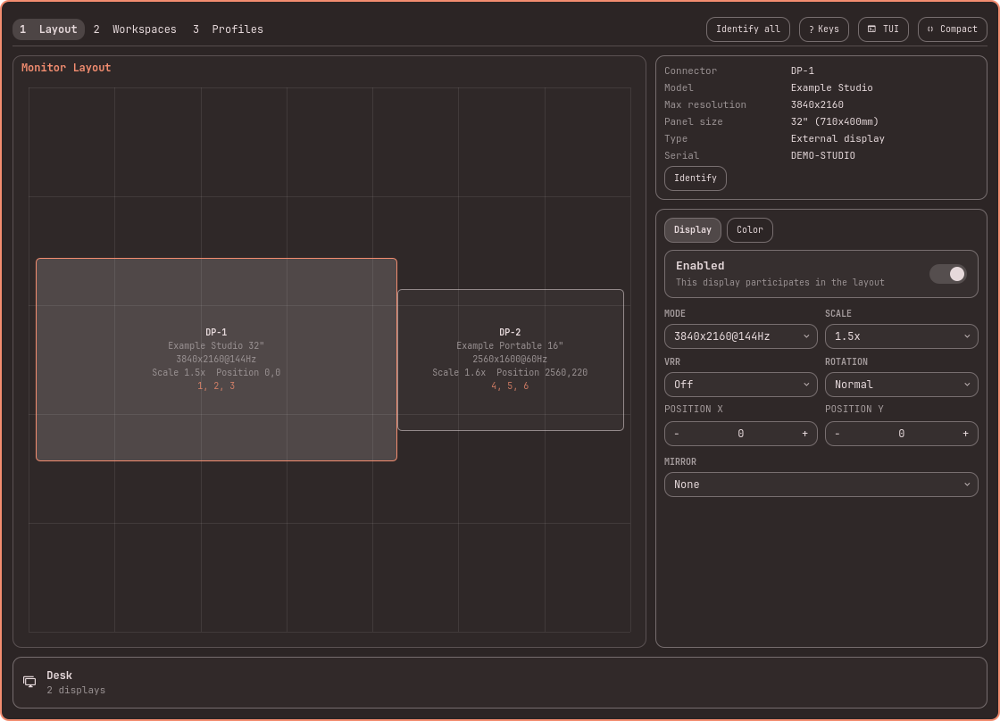

# hyprmoncfg: Multi-Monitor Manager for Omarchy

An Omarchy bar panel for [hyprmoncfg](https://hyprmoncfg.dev/). Create multi-monitor layouts for Hyprland in a visual editor and switch them automatically on hotplug and lid events.


Version 2.0 brings the panel to practical feature parity with the TUI for monitor layouts, profiles, and workspace planning—and then goes further with direct pointer-driven arrangement and per-display brightness. The compact view keeps the everyday controls close; expand it for the complete spatial editor. The TUI remains available for a keyboard-first or standalone workflow.

<details>
<summary>See the expanded editor</summary>

### Layout and display controls



### Saved profiles


</details>

## Automatically match the right layout to the connected monitors

Set your profiles up once. The desk, with the ultrawide on and the laptop panel off. The dock with three screens. The conference room projector at its own resolution and scale. After that you do nothing. Plug the monitors in and the matching profile is applied. Close the lid and the clamshell layout takes over. Undock and your laptop screen comes back at the scale you picked, with your workspaces where you put them.

It knows your monitors apart by make, model and serial, not by which port they are in. Move a cable from HDMI to DisplayPort and your layout still knows which screen is which. Two identical monitors are told apart by reading the DRM connector directly. The lid switch is read from the kernel, including the Apple SMC lid on a MacBook.

A small background service is what watches for this. It catches hotplug, lid and wake events as they happen, including before the bar has started and coming out of a suspend.

## What it does

**Live controls**

- Per-display brightness for the monitor selected on the layout, using Omarchy's own internal-backlight, DDC/CI, and Apple Display support
- Brightness stays live hardware state rather than being stored in layout profiles, and changes made by Omarchy's panel or brightness keys remain compatible

**Keyboard controls**

- The expanded panel mirrors the TUI shortcuts: `1`/`2`/`3` switch pages, `a` applies, `s` saves, `r` resets, and `?` shows the contextual key guide
- On the layout, arrows move the selected display; `Shift`, `Ctrl`, and `Alt` preserve the TUI's fine movement and nearest-display snapping
- Profile browsing and workspace settings use the same arrow, Enter, load, edit, and delete keys as the TUI

**Layout**

- Snap-to-edge arrangement, and the displays beside an output move with it when scale, mode or rotation changes its size
- Per-output scale, checked for whole-pixel sharpness
- Mirroring, rotation and flips
- Positions by hand or by snapping

**Colour and signal**

- Nine colour management presets, from sRGB through wide gamut to HDR
- Forced HDR, forced wide colour, and ICC profile paths
- 8 and 10-bit depth
- SDR brightness, saturation and transfer curve, with luminance floors and ceilings for SDR and HDR
- Variable refresh rate: off, on, or fullscreen only

**Profiles and switching**

- One profile per place you work, applied automatically on hotplug, lid and resume
- Two identical monitors are told apart, and a layout survives moving a cable to another port
- Changes you make by hand revert on their own unless you confirm them, so a layout you cannot see cannot strand you
- A machine that boots with every display switched off is recovered rather than left for you to fix from a TTY

**Workspaces**

- A workspace planner that lays your workspaces out across the displays in a profile: manual, sequential, or interleaved
- Set how many workspaces there are, how they group, and the monitor order they follow
- Per-monitor workspace rules, saved with the profile and applied with it

## Install

```sh
omarchy plugin add https://github.com/crmne/omarchy-hyprmoncfg.git --enable
```

If hyprmoncfg is missing, open the panel and choose **Install hyprmoncfg**. Omarchy opens its normal presented terminal and runs:

```sh
if pacman -Q hyprmoncfg >/dev/null 2>&1; then
  yay -S --noconfirm --needed --cleanafter hyprmoncfg
else
  omarchy pkg aur add hyprmoncfg
fi
systemctl --user enable hyprmoncfgd.service
systemctl --user restart hyprmoncfgd.service
setsid -f gtk-launch hyprmoncfg-omarchy >/dev/null 2>&1
```

The installer uses Omarchy's install helper when the package is missing and upgrades an existing package directly through `yay`. Both commands run in Omarchy's presented terminal, never invisibly inside `omarchy-shell`. The panel closes itself as that terminal opens: while open it is a full-screen overlay that holds the shell's keyboard focus, and `sudo`'s password prompt in the terminal would never receive what you type. After a successful install or upgrade it explicitly restarts the daemon, so an already-running service immediately uses the new binary, then opens hyprmoncfg through its hidden Omarchy desktop launcher. That launcher ships with the main package and carries Omarchy's standard `TUI.float` window identity, so the editor opens centered at the normal floating size without putting Omarchy-specific window logic in the panel. Saving a profile updates the panel immediately over IPC.

## Requirements

- Omarchy Quattro with third-party shell plugins
- hyprmoncfg 1.16.0 or newer (installed from the panel when missing)

## Staying up to date

Omarchy installs plugins as git checkouts and never pulls them, so this one checks for itself. When the checkout is behind its origin, the panel offers **Update this panel**, which runs `omarchy plugin update crmne.hyprmoncfg` and then restarts the Omarchy shell, because Omarchy's plugin rescan does not re-execute the QML of a plugin it has already loaded. The check happens when you open the panel, at most once every few hours, and stays quiet when the checkout has no remote or the remote cannot be reached.

Upgrading the hyprmoncfg package is a separate matter: installing runs as root and cannot restart a user service, so the previous daemon keeps serving profiles until someone restarts it. When the running daemon is older than the installed binary, the panel offers **Restart daemon**. The hyprmoncfg TUI says the same in its status line, where the message is also the button.

## Remove

### Hand display management back to Omarchy

```sh
hyprmoncfg unmanage
omarchy plugin remove crmne.hyprmoncfg
```

`unmanage` stops automatic switching, removes the hyprmoncfg include from your Hyprland configuration, hands Omarchy's monitor watcher back, and reloads Hyprland. Omarchy or any other display tool can then control your monitor configuration normally.

The daemon remains enabled and running, but this is intentional and harmless: its persisted unmanaged state prevents it from applying profiles or changing your monitor configuration, and it sits idle without using CPU. Run `hyprmoncfg manage` if you want it to take control again.

### Fully uninstall hyprmoncfg

Stopping and removing the daemon is not required after `unmanage`. If you nevertheless want to remove hyprmoncfg completely, run the commands above and then:

```sh
systemctl --user disable --now hyprmoncfgd.service
omarchy pkg drop hyprmoncfg
```

Your saved profiles remain in `~/.config/hyprmoncfg/profiles`.

## Development

```sh
omarchy plugin validate .
node --test tests/model.test.js
```
