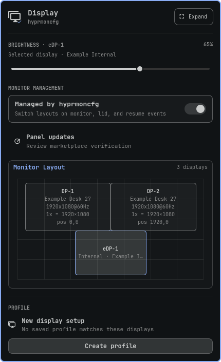
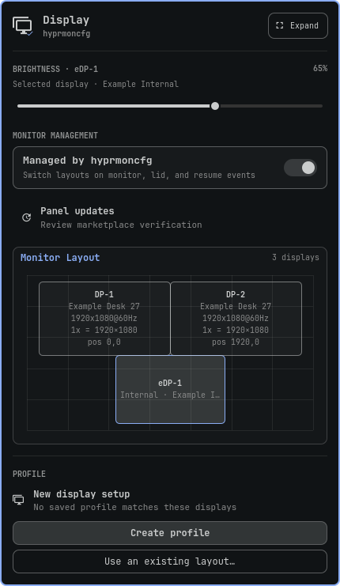
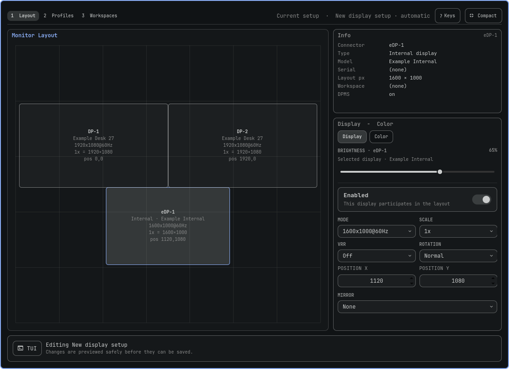
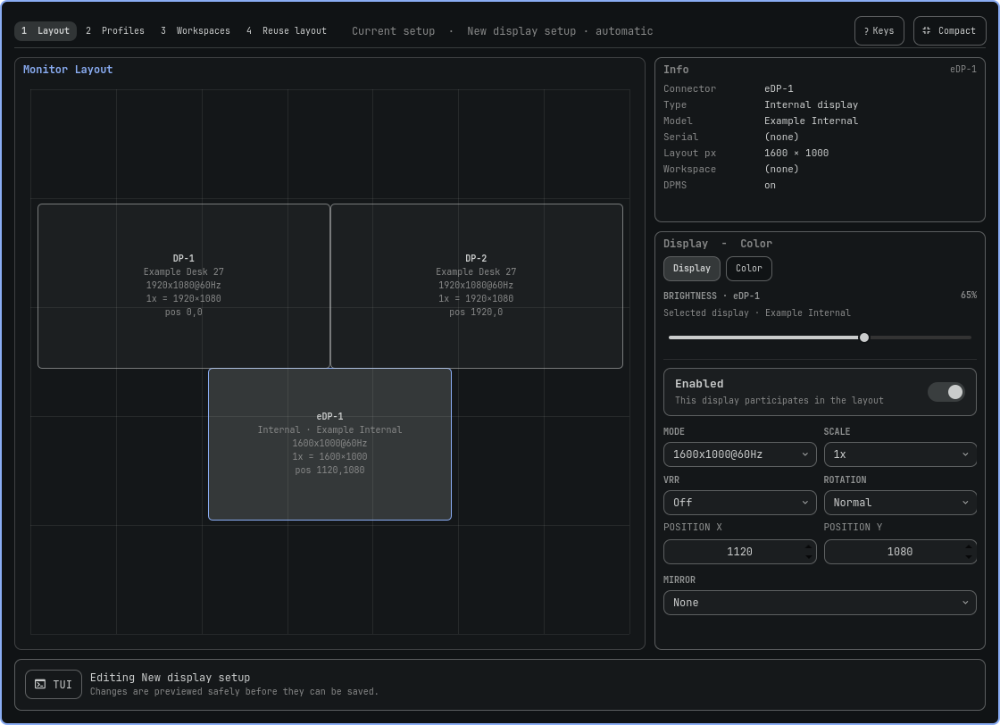
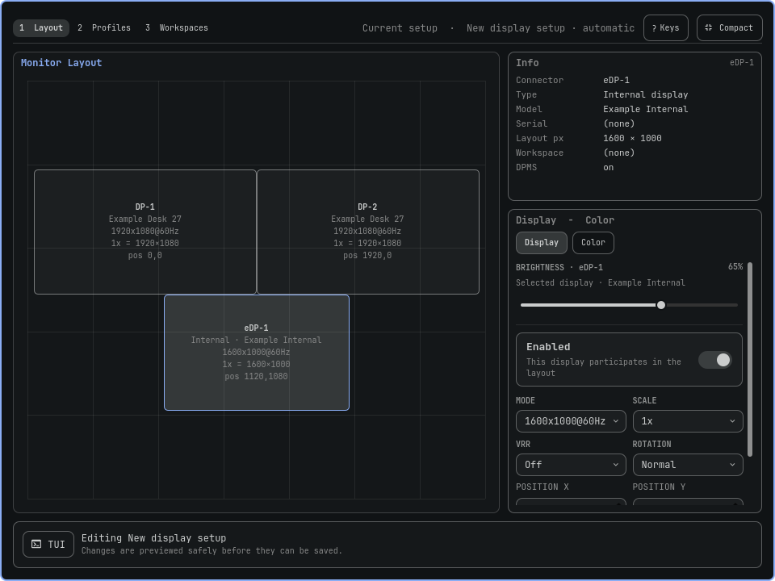
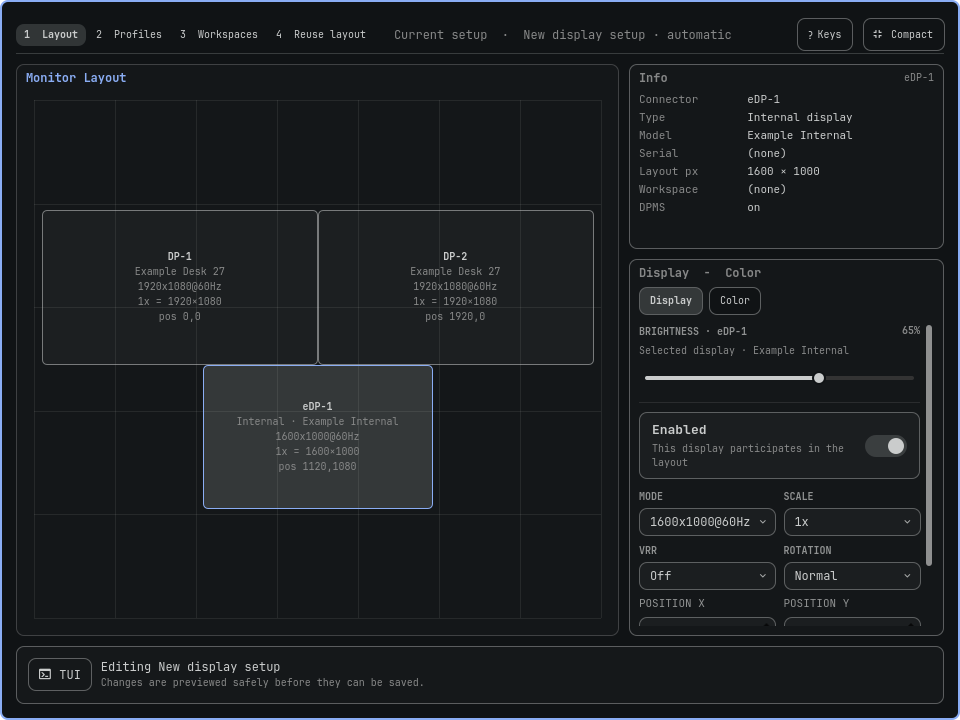
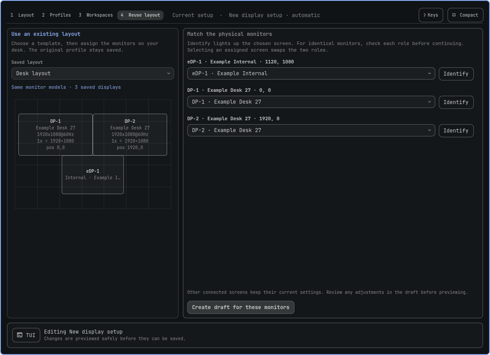

# Layout reuse: UI comparison

Before and after use the same sample data: a laptop and two identical external monitors, with a saved layout for a different set of units of the same models. The before views use upstream 2.3.5.

| View | Before | After |
| --- | --- | --- |
| Compact, 430 px wide |  |  |
| Expanded, 1120 × 812 |  |  |
| Expanded, 960 × 720 |  |  |

## Reuse a saved layout

These are isolated offscreen Quickshell renders with fabricated profiles and an inert panel host. They check layout at representative sizes, including inspector scrolling in the smaller view. They do not test live socket communication, physical hotplug, or focus during display changes.
